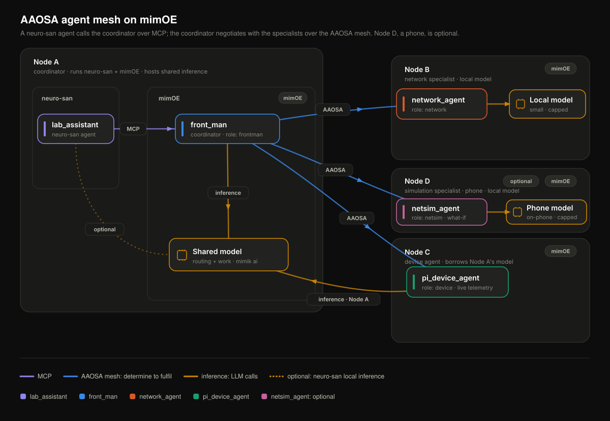

# PoV Runbook: step by step, node by node

Execute this literally, in order. Every command assumes you have sourced `pov/env.sh` in that terminal, on that machine.

## The roles

Three roles make the PoV. A fourth is optional. Assign them to whatever hardware you have.

| Role | Install argument | What it does | Wants |
|---|---|---|---|
| **Node A** coordinator | `frontman` | Entry point. Discovers peers, runs determine/adjudicate/fulfil/synthesize, serves `/chat` and `/mcp` | The most RAM. It normally also hosts inference for the whole mesh |
| **Node B** specialist | `network` | Answers questions about the **real** lab network from its model. Declines everything else | Anything. May borrow Node A's model or run its own smaller one |
| **Node C** device | `device` | Answers from **live telemetry** pushed by its host: CPU temperature, load, memory, uptime | A Linux host with readable sensors (a Raspberry Pi is ideal) |
| **Node D** simulation *(optional)* | `netsim` | Runs **what-if** analysis: capacity and load modelling, failure scenarios, the effect of a change before it is made | An Android phone running the mimOE app with a small local model. Any machine works too |

Two nodes are enough if you drop Node B. Node C is the one that makes the demo worth watching, so do not drop it. Node D is the one that shows a phone joining the mesh as a peer, not as a client; skip it and nothing else changes.

Nodes B and D are deliberately **disjoint**: B knows how the lab is wired right now, D reasons about networks that do not exist yet. A question that needs both ("we are about to add ten devices — will the current setup hold?") is what makes the coordinator task them together.



`topology.svg` sits beside this runbook, and [`topology.html`](topology.html) is the same picture animated: open it in a browser to watch traffic direction on each link.

**A note on variable names.** Nodes are declared by **role**, not by hardware: `NODE_FRONTMAN_HOST`, `NODE_NETWORK_HOST`, `NODE_DEVICE_HOST`, `NODE_NETSIM_HOST`. The older names `MBP1_IP` / `MBP2_IP` / `PI_IP` came from the reference lab (Appendix B) and are still set, as aliases derived from the role variables, so existing scripts and older notes keep working.

---

## Node 0: environment file, once, before anything

All commands below use environment variables. Set them once in a file and source it in every terminal you open, on every machine.

1. On Node A, after getting the repository (step A4 explains how; you can do A4 first on a fresh machine):

       cd ~/Projects/aaosa-mimoe
       cp pov/env.example.sh pov/env.sh

2. Edit `pov/env.sh` and fill in every blank. Where each value comes from:

   - `NODE_FRONTMAN_HOST`, `NODE_NETWORK_HOST`, `NODE_DEVICE_HOST`, and optionally `NODE_NETSIM_HOST`: which machine plays which role, by LAN address. macOS: `ipconfig getifaddr en0`. Linux: `hostname -I`. All of them must be on the same LAN with `:8083` reachable between them. Leave a role's host empty to run without it (a two-node mesh is valid; drop `network` rather than `device`).
   - `NODE_<ROLE>_USER`: the SSH login **on that machine**, used only by `pov/remote.sh`. Logins are per-machine and usually differ, so set each one literally: run `whoami` on a node to read it. Do not write `$USER` here; `env.sh` is copied to every node, and `$USER` would be re-evaluated by whichever machine sources it, so one file would silently mean a different login on each node. Leaving one blank is allowed: `remote.sh` falls back to the login you are running as and prints `<- NODE_..._USER not set, guessed from this machine` in the node map, so a wrong guess is visible rather than a confusing permission denied. Every `remote.sh` command prints that map before it does anything.
   - `NODE_<ROLE>_PASS`: the SSH password for that machine, needed only until you run `bash pov/remote.sh keys`, which installs your SSH key on every node; after that, blank the `_PASS` lines. `remote.sh` strips every `*_PASS` value out of `env.sh` before copying it to a node, so passwords never leave this machine.
   - `NODE_<ROLE>_SUDO_PASS`: **a different thing from the SSH password.** Restarting mimOE needs root on a Linux node, and over SSH the *remote* side has no terminal for a sudo prompt. Running `remote.sh keys` removes the SSH password but not this one, so a Raspberry Pi still needs it. **Leave it blank**: `remote.sh` asks on your own terminal when it needs one and pipes the answer through, so the password never goes in a file. Fill it in only for unattended runs, where nothing can ask. Blank also falls back to that node's `_PASS`. To remove the need altogether, give that login passwordless sudo for the restart only: `echo "$(whoami) ALL=(root) NOPASSWD: $(command -v systemctl) restart mimOE" | sudo tee /etc/sudoers.d/mimoe-restart`. `install-addon.sh` tries passwordless sudo first, so once that exists nothing asks again.
   - `MBP1_KEY`, `MBP2_KEY`, `PI_KEY`: the mCM credential you have for each node. This is the bearer `mim/deploy.sh` sends to that node's mCM (as `MCM_TOKEN`; legacy alias `MCM_API_KEY`). **Optional**: the file-based addon install used by this runbook needs no mCM credential at all. If your mCM rejects the key with 403 `A JWT Token is required`, your build wants minted edge access tokens: see Appendix A.
   - **The inference topology**, `NODE_<ROLE>_INFERENCE_URL` / `_ROUTING_MODEL` / `_WORK_MODEL` / `_INFERENCE_MAX_TOKENS`: which model each node reasons with, and where it reaches it. This is what makes the install identical on every node: `source pov/env.sh` then `bash pov/install-addon.sh <role>`, with no per-node edits and no inline overrides, because each node reads its own block. `install-addon.sh` resolves `NODE_<ROLE>_<SETTING>` first, then a bare `<SETTING>` as a mesh-wide default, then the role's built-in default, and prints which one it used. One rule matters: write `127.0.0.1` only inside a node's own block, meaning "this node's own mimik ai"; to point at another node use `${NODE_FRONTMAN_HOST}`, never `127.0.0.1`.
   - `NODE_<ROLE>_ROUTING_INFERENCE_URL` (optional): run the **routing** phases (determine, adjudicate, synthesize) on a *different* endpoint from the **work** phase (fulfil). Unset, the two share one endpoint, which is what every node does by default. Set it when a node's local model is small enough to truncate routing JSON (the `"Full"` speculative, or `determine error: expected JSON`): that node borrows the coordinator's larger model for routing and still answers locally. It works in reverse too, keeping routing local and cheap while only fulfil goes to a bigger model. Companions: `_ROUTING_INFERENCE_API_KEY` (another node's mimik ai has its own key) and `_ROUTING_INFERENCE_MAX_TOKENS` (routing JSON needs far fewer tokens than an answer). **The cost is real**: determine runs on every inquiry, and the up-chain's `DEADLINE_MS` covers a peer's whole reply including that peer's own inference call, so splitting routing off-node adds a LAN round trip inside that budget and concentrates routing traffic on one machine. Leave it unset unless a node's routing is actually failing.
   - `NODE_<ROLE>_INFERENCE_API_KEY`: the mimik ai key on that node: the `[milm-v1] API_KEY` in its `~/.mimoe/addon/ai-foundation.ini` (installer default `1234`). A wrong or empty value makes inference return 401/403. Set `MESH_INFERENCE_API_KEY` once if every node uses the same key.
   - `NODE_<ROLE>_INSIGHT_TOKEN`: the edge access token that node's mim uses to read its own mimOE mesh. These are minted **per node** (Appendix A), so they usually differ; `MESH_INSIGHT_TOKEN` sets one value everywhere if your build allows it.
   - `DISCOVERY_SCOPE` (default `linkLocal`): the mesh radius, `linkLocal` (same LAN), `proximity`, or `account`. The insight token above is how agents find each other (see "How membership works" below); it queries `127.0.0.1:8083/mimik-mesh/insight/v1`, so it is a node-local call, and empty or expired means that node discovers no peers and its `/mesh` is empty.

3. Load it (repeat in every new terminal, on every machine):

       source pov/env.sh

The derived `FRONT_URL`, `NET_URL`, `PI_URL`, `INFERENCE_URL` are set for you.

**`pov/env.sh` holds credentials. It is gitignored. Never commit it.**

---

## How membership works (mimik-native discovery)

An agent is "in the mesh" when its node's mimOE advertises the aaosa service, nothing more. Installing the addon on a node (steps below) registers `mimik-aaosa-aaosa-agent-v1` with that node's mimOE, and mimOE's mesh fabric propagates it to every other link-local node. The coordinator finds peers by asking its OWN mimOE's mInsight service "who is nearby and what do they run", keeping only nodes that run the aaosa service, then probing each one's `/descriptor` for its agent name and specialty. mimOE tracks liveness, so there is no heartbeat and no announce: stop a node's mimOE and it drops out of mInsight within a mesh cycle; start it and it reappears, automatically. `curl -s "$FRONT_URL/mesh"` reads exactly this discovered set. The legacy `/announce` route still exists as a bootstrap fallback (and for offline single-host testing), but it is not part of normal operation. The one thing each node needs for this to work is a valid `INSIGHT_TOKEN` (above).

---

## Node A: coordinator plus inference. Do this first.

1. Load the environment. Optionally confirm each node's mCM accepts its credential (skip this if you are using the addon install, which needs no credential):

       source pov/env.sh
       curl -s http://$MBP1_IP:8083/mcm/v1/images -H "Authorization: Bearer $MBP1_KEY" >/dev/null && echo nodeA-mcm-ok
       curl -s http://$MBP2_IP:8083/mcm/v1/images -H "Authorization: Bearer $MBP2_KEY" >/dev/null && echo nodeB-mcm-ok
       curl -s http://$PI_IP:8083/mcm/v1/images  -H "Authorization: Bearer $PI_KEY"  >/dev/null && echo nodeC-mcm-ok

   If any node answers 403 `A JWT Token is required`, that node needs a minted edge access token instead of a static key: see Appendix A, then put the minted JWT into `env.sh` (or re-mint per session, since JWTs expire).

2. Provision the model in mimik ai. The reference lab uses the id `Qwen3.6-35B-A3B-Q4_K_M` (Q4_K_M GGUF, roughly 20 GB; 32 GB RAM or more recommended). Any OpenAI-compatible chat model works. Make sure the gateway listens on the LAN interface, not loopback only, since Nodes B and C call inference here.

3. Pre-warm the model once (first load is slow; do it now, not during the demo):

       curl -s "$INFERENCE_URL/chat/completions" \
         -H "Authorization: Bearer $INFERENCE_API_KEY" \
         -H "Content-Type: application/json" \
         -d '{"model":"Qwen3.6-35B-A3B-Q4_K_M","messages":[{"role":"user","content":"hi"}]}'

   The Content-Type header is required: without it curl sends the body form-encoded and the endpoint rejects it with `body is missing required "model"`. You want a JSON completion back. If this fails, stop and fix inference first; nothing else will work.

4. Get the repository onto this machine:

       cd ~/Projects
       git clone https://github.com/mimikgit/aaosa-mimoe.git
       cd aaosa-mimoe
       chmod +x mim/*.sh pov/*.sh test/*.sh

   Offline or air-gapped? Download a release archive from
   <https://github.com/mimikgit/aaosa-mimoe/releases> on a connected machine, carry
   it across, and unpack it instead, then `chmod +x` as above:

       unzip -o ~/Downloads/aaosa-mimoe-*.zip

   Build the mim. **Every node builds its own**, so Node.js 18+ and npm are needed on each of them, not only here. Node is the only runtime involved: the bundler, the transpiler and the addon packager are all JavaScript.

       bash pov/build-here.sh     # build.sh + package-addon.sh, with a Node version check

   The first build downloads the ES5 toolchain into `mim/build-tools/` (the serverless engine is ES5; the pipeline transpiles and polyfills like mimik's own mims) and ends with `ES5 OK`. It needs network access, and on a Raspberry Pi it takes a few minutes; later builds reuse the toolchain and take seconds. Whenever you pull an update, or edit anything under `lib/` or `mim/src/`, rebuild and reinstall on **every** node (`bash pov/remote.sh setup all` does that for the others in one command). The `lib/` protocol code is bundled into the mim at build time, so source edits stay invisible to a running node until it rebuilds and reinstalls.

   `build-here.sh` runs `mim/build.sh` then `mim/package-addon.sh`; you can still run those two directly if you prefer.

5. Package the agent as a mimOE addon (file-based install, the same mechanism the mimik-ai addon uses; no mCM HTTP, no credentials):

       bash mim/package-addon.sh      # -> mim/build/aaosa-agent-0.2.0.addon

   One addon serves all three roles; a per-node ini decides the role. Every node serves the agent at the same path: `http://<node>:8083/mimik-aaosa/agent/v1`.

6. Install the coordinator role on this node (copies the addon, writes the role ini into `~/.mimoe/addon/`, restarts mimOE):

       bash pov/install-addon.sh frontman

   Verify:

       curl -s "$FRONT_URL/healthcheck"    # {"status":"ok",...}
       curl -s "$FRONT_URL/mesh"           # peers: [] for now

7. Configure the other nodes **from here**, over SSH. One command copies the **source**, builds it on each node, installs the right role there, and restarts mimOE:

       bash pov/remote.sh keys      # once: put your SSH key on every node
       bash pov/remote.sh setup all

   These commands are run **from the coordinator**, so `all` means *the other nodes*: it never includes `frontman`, which you already installed in A6, and it never includes `netsim`, the optional phone, which has no sshd and is installed by hand (Node D). Nothing is copied to this machine, and no SSH key is installed on it. Every command prints the resolved node map first, so you can see what it is about to touch. To do a single node: `bash pov/remote.sh setup network`. (Driving a coordinator from some other machine is possible but unusual: name the role explicitly, `bash pov/remote.sh setup frontman`.) Then check every node's agent from here, this one included:

       bash pov/remote.sh status

   Other subcommands: `push` copies without installing, and `exec` runs a command on each node, for example `bash pov/remote.sh exec all 'systemctl is-active mimOE'`.

   **Nothing built or installed is transferred.** The copy excludes `node_modules/`, `package-lock.json` and `mim/build/`, so a node can never run a binary produced on another machine, nor inherit a dependency tree installed for a different OS or CPU. Each node resolves its own dependencies and produces its own addon. The ES5 toolchain stays pinned by `mim/build-tools/package-lock.json`, which *is* copied, so every node's bundle is byte-identical: compare the `index.js sha256` each build prints.

   **What it does under the hood**, if you would rather do it by hand: `tar` the source over SSH into `~/aaosa-mimoe`, copy `env.sh` with the passwords blanked, then run `bash pov/build-here.sh && bash pov/install-addon.sh <role>` there. The manual equivalent is `scp -r ~/Projects/aaosa-mimoe <user>@<host>:~/` followed by the install command in the Node B and Node C sections below, which is exactly what those sections describe. Use whichever you prefer; the sections below assume the folder has arrived one way or the other.

   Password auth needs `sshpass` (`brew install hudochenkov/sshpass/sshpass` on macOS, `apt install sshpass` on Debian). `remote.sh keys` exists so that you need it once rather than every time.

   (Alternative: if your mCM build accepts HTTP image uploads, `mim/deploy.sh` still implements that flow using `MCM_TOKEN`; on runtimes that answer 400 `no image received` regardless of headers, the addon path above is the supported one.)

---

## Node B: network specialist

1. Confirm mimOE is running and `:8083` is reachable from Node A. If it is not: firewall, allow incoming for mimOE.

2. If you ran `bash pov/remote.sh setup all` from Node A in step A7, this node is already installed: skip to step 3. Otherwise the folder arrived by `scp`, and you install the network role here. There is nothing to edit and nothing to override: this node's model and endpoint are already declared in `env.sh` as `NODE_NETWORK_INFERENCE_URL` / `_ROUTING_MODEL` / `_WORK_MODEL`, and `install-addon.sh` reads its own role's block.

       cd ~/aaosa-mimoe && source pov/env.sh
       bash pov/build-here.sh              # this node builds its own addon
       bash pov/install-addon.sh network
       curl -s "$NET_URL/descriptor"       # verify

   The install prints which model and endpoint it resolved, and whether they came from `env.sh` or a role default, so you can confirm it took this node's block and not someone else's.

   The `network` role also bakes in a brevity instruction, and `env.sh` caps this node at 256 tokens, because a peer's whole `/aaosa` reply must return inside mimOE's roughly 20 s outbound-read ceiling and a slow local model (a 4B at roughly 26 tok/s) would otherwise overrun it and time out. To give this node full-length answers instead, point `NODE_NETWORK_*` at the coordinator's fast model and raise `NODE_NETWORK_INFERENCE_MAX_TOKENS` to 2048 (there is a commented block in `env.example.sh` that does exactly this), or pass `INSTRUCTIONS=""` on the install line to drop the brevity clamp.

3. That is it, no heartbeat. Installing the addon registered the aaosa service with this node's mimOE, so the coordinator discovers `network_agent` through mInsight automatically. Membership tracks the node's mimOE: closing the lid or stopping mimOE takes Node B out of the mesh; bringing it back puts it in, with no loop to run.

4. Verify from any machine: `curl -s "$FRONT_URL/mesh"` now lists `network_agent` with `"fresh":true`. (Empty? Confirm `INSIGHT_TOKEN` is set and unexpired on the coordinator node: that token is what lets it read mInsight.)

---

## Node C: device agent (the grounded one)

1. Confirm mimOE is active:

       systemctl status mimOE        # or your service name

2. If you ran `bash pov/remote.sh setup all` from Node A in step A7, this node is already installed: verify with `curl -s "$PI_URL/descriptor"` and go to step 3. Otherwise install the device role here:

       cd ~/aaosa-mimoe && source pov/env.sh
       bash pov/build-here.sh              # this node builds its own addon
       bash pov/install-addon.sh device
       curl -s "$PI_URL/descriptor"        # verify

   Step 3 below still has to run **on this node**, because it reads this host's own sensors. `remote.sh` cannot do it for you.

3. The telemetry feed is **already running**. A serverless mim cannot read `sysfs`, so the host pushes its own CPU temperature, load, memory and uptime into the local mim, and that is what the device agent grounds its answers on. Installing the `device` role registers that loop as a systemd service, so it starts on boot and restarts on failure:

       systemctl status aaosa-telemetry
       curl -s "$PI_URL/metrics"           # should show a real cpuTempC

   The unit is `/etc/systemd/system/aaosa-telemetry.service`, running `pov/pi-telemetry-push.sh` from the checkout with `INTERVAL=15`. Re-running the installer rewrites and restarts it rather than starting a second loop. `TELEMETRY_INTERVAL` changes the period; `TELEMETRY_SERVICE=0` on the install command skips the service entirely, in which case run the feed yourself and leave it in its own terminal:

       cd ~/aaosa-mimoe && source pov/env.sh
       INTERVAL=15 bash pov/pi-telemetry-push.sh

   It does telemetry and nothing else: membership comes from mInsight, so there is no announce to suppress. On a host with no systemd (macOS) or no `/proc/loadavg`, the installer says so and leaves the manual command to you.

4. Verify: `curl -s "$PI_URL/metrics"` shows a real `cpuTempC`, and `curl -s "$FRONT_URL/mesh"` lists both peers fresh (membership came from mInsight the moment the addon was installed in step 2, before telemetry even started).

---

## Node D: network simulation specialist on a phone (optional)

Everything above this line works without Node D. Add it when you want to show that a phone joins the mesh as a **peer that the coordinator tasks**, not as a client that calls it, and that it reasons on a model it hosts itself.

The role is `netsim`. It answers what-if questions — capacity and load modelling, failure and outage scenarios, the effect of a proposed change — and it is deliberately disjoint from Node B, which only knows the lab as it is wired right now. Neither one claims the other's questions, so `determine` picks between them for a narrow inquiry and tasks both for a broad one.

**This node is installed by hand.** A phone has no sshd and no remote sudo, so `pov/remote.sh` never provisions it: `setup all` skips it silently, naming it prints the two commands below, and `status` still reports it because it answers HTTP on the LAN like any other node.

1. **On the phone**, before anything else:

   - the **mimOE Android app** installed and running, with `:8083` reachable from the coordinator (same Wi-Fi, and the AP must not have client isolation on): `curl -s http://<phone-ip>:8083/mimik-mesh/insight/v1/nodes` from Node A should answer.
   - a **local model** loaded through mimik ai on the phone. This is what makes the node interesting; a phone borrowing the coordinator's model proves nothing.
   - a **shell with Node.js 18+**, which on Android means Termux (`pkg install nodejs-lts`). The addon is built on the device like every other node.
   - the phone's LAN address in `NODE_NETSIM_HOST`, and its model name in `NODE_NETSIM_WORK_MODEL`, in `pov/env.sh` **on the coordinator** — then re-run `bash pov/remote.sh push all` so the other nodes see the new member's block too.

2. **Get the folder onto the phone.** Any route works, because nothing here needs SSH: a USB copy, a share sheet, `git clone` in Termux, or from the coordinator over HTTP. Do not copy `node_modules` or `package-lock.json`; the phone builds its own.

3. **Build and install, in Termux:**

       cd ~/aaosa-mimoe && source pov/env.sh
       bash pov/build-here.sh              # first build downloads the ES5 toolchain
       bash pov/install-addon.sh netsim

   The installer detects Android and stops short of restarting mimOE, ending with an **ACTION REQUIRED ON THIS DEVICE** block. That is expected: the addon and the `netsim` ini are written, but the app has not reloaded them. Force the behaviour either way with `MIMOE_RESTART=manual` or `MIMOE_RESTART=auto` if the detection is wrong for your device.

4. **Restart mimOE from the app** — stop it and start it again in the mimOE UI. There is no command for this; the app owns the process.

5. **Verify from Node A**, not from the phone:

       curl -s "$NETSIM_URL/descriptor"    # netsim_agent, with its specialty
       curl -s "$FRONT_URL/mesh"           # now lists four agents
       bash pov/remote.sh status           # netsim appears, with no login shown

   Then ask it something only it can answer:

       curl -s "$FRONT_URL/chat" -H "Content-Type: application/json" \
         -d '{"message":"If we add ten more devices to this lab, what happens to the network?"}'

   The trace should show `netsim_agent` claiming it. A question about the current wiring should go to `network_agent` instead, and a question that spans both should task both.

**If the phone's answers come back empty or the trace shows `determine error: expected JSON`,** its model is too small to emit routing JSON reliably. Keep the answer local and borrow the coordinator's model for routing only, with the `NODE_NETSIM_ROUTING_INFERENCE_URL` block already commented out in `env.example.sh`. The 200-token cap and the brevity instruction the role applies are there for the same reason: a peer's whole reply must return inside mimOE's roughly 20 second outbound-read ceiling, and a phone is the slowest node in the mesh.

Nothing else in the PoV changes. The coordinator discovered the phone through mInsight the moment its mimOE advertised the aaosa service; no file on Node A lists it, and unplugging the phone drops it out of `/mesh` within a mesh cycle.

---

## Demo (run from Node A, or any machine that sourced env.sh)

1. The three routing scenarios:

       curl -s "$FRONT_URL/chat" -H "Content-Type: application/json" -d '{"message":"How hot is the raspberry pi right now, and is it under load?"}'
       curl -s "$FRONT_URL/chat" -H "Content-Type: application/json" -d '{"message":"What network setup do we need to add a second raspberry pi to this lab?"}'
       curl -s "$FRONT_URL/chat" -H "Content-Type: application/json" -d '{"message":"Given the pi'"'"'s temperature and load, is it safe to add more agent workloads, and what network prep would a second pi need?"}'

   The first should route to the device agent alone, the second to the network agent alone, the third to both with a synthesized answer. With the optional Node D installed, add a fourth:

       curl -s "$FRONT_URL/chat" -H "Content-Type: application/json" -d '{"message":"If we add ten more devices to this lab, what happens to the network?"}'

   That one should go to `netsim_agent`, and the second question above should still go to `network_agent`: the two are written to be disjoint. `bash pov/demo.sh` runs the whole set in order, mesh membership first.

   Check each response's `trace`. The `determine` phase lists who was consulted (`claimed` / `declined` / `unreachable`); the `fulfil` phase lists what each tasked peer returned (`ok` / `empty` / `timeout`), with per-phase timings. `empty` means the peer replied but with no usable content, so it is not counted as a contributor and the coordinator answers that part itself; a peer stuck on `empty` is an inference/model issue on that node, not a mesh issue.

2. The dynamism showcase:

       bash pov/dynamic-demo.sh          # reads the coordinator's address from env.sh

   While it loops: stop mimOE on Node C (`sudo systemctl stop mimOE`) and watch it fall out of `/mesh` within a mesh cycle as mInsight stops advertising it; close Node B's lid for the same story; bring either back and watch it rejoin on its own, no heartbeat to restart. Install the addon on a further node — Node D above, or any machine with a new role and DESCRIPTION — and watch it join mid-run the moment its mimOE registers the aaosa service. A phone is the sharpest version of this: walk it out of Wi-Fi range and back.

---

## Section D: publish the coordinator to mimOE's MCP gateway

The coordinator already serves a Model Context Protocol endpoint at `$FRONT_URL/mcp`, built with `@mimik/mcp-kit` and bundled into the addon. It advertises **one tool**, `front_man`, taking a single `inquiry` string; calling it runs the whole AAOSA mesh. This section publishes that tool to mimOE's built-in MCP gateway, through mimOE Studio, so any MCP client on the mesh can discover it.

Background and the full surface description: [`neuro-san/MCP.md`](../neuro-san/MCP.md).

### D.1 Smoke-test the MCP surface first (no MCP server needed)

Confirm the endpoint works before registering it anywhere:

```sh
# list tools
curl -s "$FRONT_URL/mcp" -H 'content-type: application/json' \
  -d '{"jsonrpc":"2.0","id":1,"method":"tools/list"}'

# call the tool: this runs the whole mesh
curl -s "$FRONT_URL/mcp" -H 'content-type: application/json' \
  -d '{"jsonrpc":"2.0","id":2,"method":"tools/call",
       "params":{"name":"front_man","arguments":{"inquiry":"how hot is the pi and can we add a second one?"}}}'
```

Expected: `tools/list` returns `front_man` with `inquiry` required, and `tools/call` returns `{"result":{"content":[{"type":"text","text":"…mesh answer…"}],"isError":false}}`. A `GET` on `/mcp` correctly returns 405: no server-to-client SSE stream is offered, so clients use plain POST.

### D.2 Add the coordinator to mimOE's MCP gateway, using mimOE Studio

mimOE ships a built-in **MCP gateway**. Publishing the coordinator through it is what makes `front_man` discoverable to any MCP client on the mesh, rather than each client needing the node's URL. **Do this in mimOE Studio** ([download](https://developer.mimik.com/mimOE-studio-download)), which is the supported way to manage what a node exposes; the raw registration API below is kept only as an automation escape hatch.

What Studio needs, and where each value comes from:

| Field | Value | Where it comes from |
|---|---|---|
| Server name | `front_man` | the agent's `NAME`, set by `install-addon.sh frontman` |
| URL | `http://<node-a>:8083/mimik-aaosa/agent/v1/mcp` | `echo "$FRONT_URL/mcp"` on Node A. Use the node's **LAN address**, not `127.0.0.1`: the gateway and its clients call this from other machines |
| Transport | streamable HTTP | the endpoint answers `POST` only. A `GET` returns 405 by design: no server-to-client SSE stream is offered |
| Auth | none by default | the `/mcp` route is open. If you put a bearer in front of it, give the gateway the same token |
| Tools exposed | one: `front_man`, argument `inquiry` (string) | confirmed by the `tools/list` call in D.1 |

Steps:

1. Open **mimOE Studio** and connect it to Node A, the coordinator.
2. Confirm Studio lists the `aaosa-agent` addon as running on that node. If it does not, the install in A6 did not take: re-run `bash pov/install-addon.sh frontman` and make sure mimOE actually restarted (see the note in the troubleshooting section about macOS).
3. Open the node's **MCP gateway** view and add a new MCP server with the values in the table above.
4. Save, then confirm the gateway lists `front_man` among its available tools.

Verify from a client that the gateway serves it, using the gateway's own address rather than the node's:

```sh
curl -s "http://<gateway-host>:8083/<gateway-mcp-path>" -H 'content-type: application/json' \
  -d '{"jsonrpc":"2.0","id":1,"method":"tools/list"}'
```

`front_man` should appear with the same `inquiry` schema that D.1 returned directly from the node. If it does, any MCP client pointed at the gateway can now run the whole AAOSA mesh with one tool call.

### D.3 Automating the same registration (optional)

Studio is the supported path. If you need this scripted instead, the agent can POST its own record to a registry endpoint at install time:

```sh
cd ~/Projects/aaosa-mimoe && source pov/env.sh
export MCP_REGISTRY_URL="http://<mimik-mcp-host>:8083/<registration-path>"
export MCP_REGISTER_TOKEN="$INSIGHT_TOKEN"     # or a dedicated edge JWT
bash pov/install-addon.sh frontman
```

`MCP_SELF_URL` (the callback URL the registry stores) defaults to this node's own `…/mimik-aaosa/agent/v1/mcp`. Set it explicitly if the registry must reach this node on a different address than the node knows about. Re-registering is idempotent:

```sh
curl -s -X POST "$FRONT_URL/mcp/register"
# -> {"registered":true,"registryUrl":"…","record":{…},"result":{…}}
```

The record it sends is deliberately neutral, because a registry API can differ:

```json
{
  "name": "front_man",
  "description": "Coordinates lab operations inquiries across the mesh.",
  "inputSchema": { "type": "object",
    "properties": { "inquiry": { "type": "string", "description": "…" } },
    "required": ["inquiry"] },
  "transport": "streamable-http",
  "url": "http://<node-a>:8083/mimik-aaosa/agent/v1/mcp",
  "agent": "front_man",
  "type": "mcp-tool"
}
```

sent with `Authorization: Bearer <MCP_REGISTER_TOKEN>`. The tool spec (`name`, `description`, `inputSchema`) comes straight from the `@mimik/mcp-kit` server; only the surrounding envelope is hand-built. If your endpoint expects a different envelope, change the one `record` in `registerWithMcp()` in `mim/src/index.js`. Nothing else moves.

Register the specialists too if you want them individually callable. For the demo, publishing the coordinator alone is the right choice: one tool call runs the whole mesh.

**Section D is optional for the neuro-san demo.** Section E connects neuro-san straight to `$FRONT_URL/mcp` on the node, and the agent side is identical whether or not the gateway is in the path. That is the point of doing it over MCP.

---

## Section E: add the lab to neuro-san

Two networks are provided. E.1 is a standalone network whose only tool is the mesh. E.2 grounds one node of neuro-san's large simulated telco example in the real Raspberry Pi, which is the more interesting demonstration.

### E.0 Prepare neuro-san

On the machine that will run neuro-san (it can be Node A, or any host that can reach `$FRONT_URL`):

```sh
mkdir my_project && cd my_project
uv init
uv venv
source .venv/bin/activate
uv add neuro-san-studio
ns init                 # interactive: pick your LLM provider
```

Set the provider key that neuro-san's own coordinator reasons with, in a `.env` file in the project root or exported in the shell. This is independent of your local mimOE model:

```sh
export ANTHROPIC_API_KEY="…"     # or OPENAI_API_KEY
ns check-llm-keys                # confirms the key is picked up
ns check-config                  # confirms the model names you can use
```

### E.1 Standalone: the lab as its own agent network

The network is [`neuro-san/registries/lab_ops_mcp.hocon`](../neuro-san/registries/lab_ops_mcp.hocon). It is self-contained (no `include` directives), so it can be served straight from this repository.

1. Point the URL at your coordinator. The file ships with a placeholder:

       # in neuro-san/registries/lab_ops_mcp.hocon
       "url": "http://192.168.1.101:8083/mimik-aaosa/agent/v1/mcp"

   Replace `192.168.1.101` with your `MBP1_IP` (Node A). It must be reachable from the neuro-san host: check with `curl -s http://<node-a>:8083/mimik-aaosa/agent/v1/healthcheck` from there first.

2. Confirm the model name on line `llm_config` is one your install knows (`ns check-config` lists them). The file ships with `claude-sonnet-5`; change it if your install disagrees.

3. Serve it. Either point neuro-san at this repository's manifest:

       export AGENT_MANIFEST_FILE=/path/to/aaosa-mimoe/neuro-san/registries/manifest.hocon
       ns run

   or copy the file into your neuro-san-studio `registries/` directory and add `"lab_ops_mcp.hocon": true` to that project's `manifest.hocon`.

4. `ns run` starts the server on `localhost:8080` and the nsflow UI on `http://localhost:4173/`, with logs under `logs/`. Open the UI, select the **lab_ops_mcp** network, and ask:

       How hot is the raspberry pi right now, and is it under load?

   neuro-san's `lab_assistant` agent calls the `front_man` MCP tool, which runs the whole AAOSA mesh across your nodes and returns one synthesized answer. **No adapter is involved.** neuro-san treats any tools entry whose URL ends in `/mcp` as an MCP server, connects over streamable-HTTP, lists the tools, and calls them.

### E.2 Grounding one node of the telco example

This is the demonstration worth showing. neuro-san's `telco_network_orchestration` example simulates an Australian telco: three regions, regional supervisors, site managers, and a dozen node agents that all invent plausible numbers. Give exactly one of them a real Raspberry Pi and that branch stops simulating.

The worked reference is [`neuro-san/registries/examples/telco_network_orchestration.hocon`](../neuro-san/registries/examples/telco_network_orchestration.hocon). It is **not** served from this repository, because it uses `include` directives that exist in neuro-san-studio (`config/llm_config.hocon`, `registries/aaosa.hocon`, `registries/expertise_scoping_instructions.hocon`). Work in your neuro-san-studio project.

1. Import the example if you do not already have it:

       ns import          # interactive: choose the Industry category, telco_network_orchestration

2. Copy the lab network into the **same** registries directory, because a leading-slash tool reference means "another network served by this same server":

       cp /path/to/aaosa-mimoe/neuro-san/registries/lab_ops_mcp.hocon <your-neuro-san-project>/registries/

   Edit its URL to your Node A address as in E.1.

3. Add **both** networks to that project's `manifest.hocon`:

       "telco_network_orchestration.hocon": true,
       "lab_ops_mcp.hocon": true

4. Apply the two edits to `telco_network_orchestration.hocon`. Pick one leaf node agent (the reference uses `NodeAgent_QLD2_1`) and give it the lab as a downstream tool:

       {
           "name": "NodeAgent_QLD2_1",
           "function": ${aaosa_call}{
               "description": "Monitors network node performance in QLD including CPU load, latency, and packet loss."
           },
           "instructions": ${instructions_prefix} """
       …unchanged upstream instructions…
       """,
           "command": "Respond to inquiry using the tools.",
           "allow": ${?allow_llm_config_downstream}
           "tools": ["/lab_ops_mcp"]
       },

   and add a sample query that exercises it:

       "There is only one raspberry pi in this network. By checking that it is alive, what it is temperature?",

   The full modified file in `examples/` shows exactly this, with its provenance and the upstream copyright header intact.

5. Run it:

       ns run

   Select the **telco_network_orchestration** network in the UI and ask the sample query. The inquiry travels `NetworkOrchestrator` to `RegionalSupervisor_QLD` to `SiteManager_QLD2` to `NodeAgent_QLD2_1`, which calls `/lab_ops_mcp`, which calls the `front_man` MCP tool, which runs the AAOSA mesh on your hardware and reads the Pi's actual temperature. Ask a sibling node the same question and it will make a number up. That contrast is the whole point.

**Keep `pov/pi-telemetry-push.sh` running on Node C** for any of this to return real values. Without it the device agent has no telemetry to ground on.

---

## If something misbehaves

### Remote configuration (`pov/remote.sh`)

- **`frontman ... this machine, not touched by 'all'`**: expected. You run `remote.sh` from the coordinator, so `all` means the other nodes: no key is installed on this machine, nothing is copied to it, and the role you installed in A6 is not reinstalled. To configure a coordinator from a different machine, name it: `bash pov/remote.sh setup frontman`.
- **`skipping '<role>' (<ip>): that is this machine`**: expected, not an error. `remote.sh` never SSHes to itself. Install that role locally with `bash pov/install-addon.sh <role>`.
- **`Permission denied` against a node, or the node map shows `<- NODE_..._USER not set, guessed from this machine`**: that node's login differs from the one you are running as. Read it with `whoami` on that machine and set `NODE_<ROLE>_USER` in `env.sh`. The map that every `remote.sh` command prints first is there to make exactly this visible before anything is copied.
- **`no key access to <user>@<host> and no NODE_<ROLE>_PASS set`**: neither auth method is available for that node. Either set the password in `env.sh`, or run `ssh-copy-id <user>@<host>` by hand once.
- **`sshpass is required for password auth and is not installed`**: install it (`brew install hudochenkov/sshpass/sshpass`, or `apt install sshpass`), or skip passwords entirely by running `ssh-copy-id` to each node yourself. Once keys work, `remote.sh` never needs `sshpass` again.
- **`tar: Ignoring unknown extended header keyword 'LIBARCHIVE.xattr...'` on a Linux node**: a warning, not a failure. Extraction succeeds and tar exits 0, so the install continues. macOS `bsdtar` writes extended-attribute headers that GNU tar does not recognise, and files you unzipped from a download carry `com.apple.quarantine`. `remote.sh` now strips that metadata when it builds the archive, so it should not appear. If you see it from an older copy, or from some other transfer, it is safe to ignore; to clear the attribute at the source: `xattr -dr com.apple.quarantine ~/Projects/aaosa-mimoe`.
- **The device agent answers but has no numbers, and `/metrics` says `no telemetry pushed yet`**: the feed is not running. `systemctl status aaosa-telemetry` on that node, and `journalctl -u aaosa-telemetry -n 20` for why. `bash pov/remote.sh status` shows the same thing from the coordinator, as a `telemetry` line. If the service was never installed (no systemd, or `TELEMETRY_SERVICE=0`), run `INTERVAL=15 bash pov/pi-telemetry-push.sh` on that host.
- **`role 'netsim' is installed by hand, not over SSH`**: expected. Node D is the phone: no sshd, no remote sudo, nothing for `remote.sh` to drive. `setup all` skips it without a word; you only see this message when you name it. Follow the Node D section instead. `status` still reports it, because reaching it is plain HTTP.
- **`no addon in mim/build/ — run: bash mim/build.sh && bash mim/package-addon.sh`**: seen on the node being installed, not on the coordinator. Since v0.2.0 each node builds its own addon — `remote.sh` copies source only, never `node_modules`, `package-lock.json` or `mim/build` — so this means `pov/build-here.sh` did not run or did not finish there. Re-run it on that node and read the output; the usual cause is a Node version older than 18.
- **`setup` reports FAILED with `restarting mimOE needs root` even though you supplied a password**: fixed in v0.2.0. `remote.sh` probed key access with `ssh <host> true` from inside the pipeline carrying the password, and ssh forwards stdin to the remote command, so the probe consumed the password and the remote `head -n1` read EOF. The probe now runs with `-n </dev/null`. If you see this on an older copy, update `pov/remote.sh`.
- **`setup` reports FAILED with `restarting mimOE needs root, and this session has no way to authenticate`**: the role ini was written but mimOE never reloaded it, so nothing is in effect. Run `remote.sh` from an interactive terminal and it will ask for that node's sudo password; the error only appears when nothing can be asked (a pipeline, cron, an editor's task runner) and `NODE_<ROLE>_SUDO_PASS` is empty. Set that variable for unattended runs, or give the login passwordless sudo for the restart. This is separate from SSH auth: keys fix the login, not sudo.
- **`setup` reports FAILED with `no way to restart mimOE found on this host`**: no systemctl unit and no `~/.mimoe/bin/mimoe`, which is the usual situation on macOS. The ini is written and correct; mimOE just has to be restarted by hand, after which `curl -s "$NET_URL/descriptor"` should reflect the new config. Until v0.2.0 this case reported success, which is a good way to spend an hour wondering why a node still behaves like the old install.
- **The role installed, but the copied `env.sh` on that node has empty passwords**: deliberate. `remote.sh` blanks every `*_PASS` value before copying, so node logins stay on the machine you run from. `INFERENCE_API_KEY` and `INSIGHT_TOKEN` are copied, because the agent needs them.

### Everything else

- **`Invalid Api Key` while minting tokens**: the `--api-key` for that node is wrong or empty; it must be the apiKey that node's mimOE was configured with at startup.
- **`jq: parse error` while minting**: the CLI printed an error, not JSON; re-run without `| jq` to read it.
- **Chat times out or calls get cut off**: two separate timeouts govern this. `INFERENCE_TIMEOUT_MS` (default 60000) is how long a node waits for its *own* inference call; `DEADLINE_MS` (default 25000, doubled for the fulfil step) is how long the coordinator waits for a *peer's* `/aaosa` reply, and that reply includes the peer's own inference call, so if peers show `unreachable`, raise `DEADLINE_MS` to comfortably exceed one call's latency. With thinking off, calls are 1 to 2 s and neither is hit; if you time out *often*, a node is probably still running with thinking on (reinstall it) or the model is genuinely slow. Pre-warm the model (A3) so the first call is not cold. All protocol calls queue on one inference server; that is the expected bottleneck.
- **Empty mesh**: the coordinator's `INSIGHT_TOKEN` is missing or expired (it cannot read mInsight, so it sees no peers; re-mint per Appendix A), or the other nodes have not had the addon installed yet (nothing for mInsight to advertise), or they are on a different `DISCOVERY_SCOPE`. Confirm the raw view: `curl -s http://127.0.0.1:8083/mimik-mesh/insight/v1/nodes?type=linkLocal -H "Authorization: Bearer $INSIGHT_TOKEN"` should list the nodes running `mimik-aaosa-aaosa-agent-v1`.
- **Peer in mesh but always unreachable**: the node's firewall blocks `:8083` from the LAN, or its mimOE advertises an address the coordinator cannot route to. The peer URL comes straight from mInsight (`node.url` plus the service's own path), so a bad `127.0.0.1` self-announce is no longer possible.
- **Model errors**: the `model` id in env must match the id provisioned in mimik ai exactly.
- **401/403 from inference**: `INFERENCE_API_KEY` missing or wrong. The key rides only on inference calls, never on peer `/aaosa` traffic.
- **Check the inference plane from inside a mim**: `curl -s "$FRONT_URL/debug/inference"` probes the OpenAI endpoint four ways and reports which header strategies this engine accepts. A healthy modern engine passes the three clean strategies and returns 403 for `legacy_crlf_inject`; that 403 is a header-injection defense working, not a fault. Only set `INFERENCE_CT_INJECT=1` if that CRLF strategy is the *sole* one that passes (old engines).
- **A peer returns `empty` in the trace**: it answered but produced no usable content (common with quantized "thinking" models that spend their budget reasoning). The coordinator silently answers that part itself. Confirm by calling the peer directly, `curl -s "$NET_URL/chat" -H "Content-Type: application/json" -d '{"message":"<a question in its specialty>"}'`, and check its inference config; it is a node-local model issue, not a mesh one.
- **A peer shows `declined` with `determine error: llm: expected JSON, got: …`**: its routing call failed to yield parseable JSON, either empty (thinking-only) or JSON truncated mid-object by the token cap (you will see the partial JSON in the `reason`, and the call runs about as long as the budget allows). Same thinking-model budget exhaustion, on the routing step, so the peer cannot claim and the coordinator answers alone. The build disables the model's reasoning outright, top-level `enable_thinking:false` in every request, which is the switch this milm runtime honors (`/no_think` and `chat_template_kwargs.enable_thinking` are both ignored here). With thinking off, routing JSON returns in about 1 s with populated `content`; it also retries once and honors `INFERENCE_MAX_TOKENS`. If you set `INFERENCE_ENABLE_THINKING=1` to bring reasoning back, expect 20 to 40 s calls and raise `DEADLINE_MS` (and the inference timeout in `lib/llm.js`) to match. Confirm the switch with a raw call: `content` populated plus empty `reasoning_content` plus `finish_reason:"stop"` means thinking is off.
- **A peer `claimed` in `determine` but no `fulfil` line appears (coordinator answered alone)**: the adjudicator, the coordinator's separate delegation-plan call, returned an empty or agent-mismatched plan and dropped the claim. The build falls back to tasking every claimant and records `adjudicate: empty_plan_defaulted` in the trace instead of silently self-answering. Seeing that marker often means the routing model is unstable; the thinking-off and `INFERENCE_MAX_TOKENS` remedies above apply.
- **The device agent answers "I can report the temperature upon request" instead of a number**: it was short-circuited on a determine-phase speculative answer, before its telemetry was read. Determine runs before `gatherFacts`, so a device agent asked to speculate can only describe its own capabilities. Two guards prevent it: an agent with a `gatherFacts` hook never emits a speculative claim (enforced in `determine()` in `lib/aaosa.js`), and the `device` role installs with `SHORT_CIRCUIT=0`. If you see this symptom, you are running a stale bundle: rebuild, repackage, and reinstall that node, or set `SHORT_CIRCUIT=0` on it as an immediate workaround. Confirm the fix by checking that the trace ends in `fulfil`, not `short_circuit`.
- **`body is missing required "model"`**: the request reached inference without `Content-Type: application/json`. In curl, add the header. The mim injects it on inference calls itself.
- **403 `invalid edgeAccessToken: A JWT Token is required`**: the bearer you passed to mCM is not an edge access token JWT. Mint per node (Appendix A); if it worked before and stopped, the JWT expired, re-mint.
- **Image upload 400 `no image received` (persists even via `mim/deploy.sh`)**: your runtime installs mims as file-based addons rather than mCM HTTP uploads. Use `bash mim/package-addon.sh` plus `bash pov/install-addon.sh <role>` (steps A5/A6); it needs no mCM credential at all.
- **Image upload 400 `no image received` (hand-rolled curl)**: curl's `Expect: 100-continue` on multipart uploads; mCM does not handle it. `mim/deploy.sh` disables it (`-H "Expect:"`); add that header if uploading by hand.
- **Image upload 400 (other messages)**: usually the tarball. macOS tar adds AppleDouble/xattr entries for files from a downloaded zip; rebuild with `mim/build.sh` (plain ustar, must show exactly `index.js`).
- **Agents say the inquiry is empty, or the coordinator asks for details**: your `/chat` curl lacks `-H "Content-Type: application/json"`; the engine drops bodies with other content types. Same class of issue as the step A3 pre-warm curl.
- **neuro-san cannot reach the tool**: from the neuro-san host, `curl -s http://<node-a>:8083/mimik-aaosa/agent/v1/healthcheck`. If that fails it is routing or firewall, not neuro-san. If it succeeds but the tool never appears, re-check that the URL in the HOCON ends in `/mcp`.
- **The phone installed cleanly but never appears in `/mesh`**: the mimOE app was not restarted, so it is still serving the old registration. The installer said so, in the `ACTION REQUIRED ON THIS DEVICE` block, and exits 0 there because there is nothing it can do about it. Stop and start mimOE in the app, then `curl -s "$NETSIM_URL/descriptor"` from the coordinator. If that answers but `/mesh` stays at three, the phone is on a different subnet or the access point has client isolation on: `curl -s http://<phone-ip>:8083/mimik-mesh/insight/v1/nodes` from Node A is the quickest way to tell the two apart.
- **`netsim_agent` and `network_agent` both claim everything, or neither claims anything**: their descriptions have drifted into each other. They are written to be disjoint — one owns the network as it is configured right now, the other owns hypotheticals — and routing quality is description quality. Check what each node is actually serving with `curl -s "$NETSIM_URL/descriptor"` and `curl -s "$NET_URL/descriptor"`; if a node was installed before v0.2.0 it still carries the old overlapping text, so reinstall it.
- **Wrong routing**: routing quality is description quality; sharpen the agent DESCRIPTION and redeploy.

---

## Appendix A: minting edge access tokens

Some mimOE builds reject static keys on mCM with 403 `invalid edgeAccessToken: A JWT Token is required`. `INSIGHT_TOKEN` always wants one of these. In that case the per-node credential must be a minted edge access token:

1. Get a **Developer ID Token**: [console.mimik.com](https://console.mimik.com), create a project, open the project, click **Get ID Token** (short-lived; re-copy when minting fails).
2. Mint per node, using that node's locally configured mimOE API key (`grep -rn "API_KEY" ~/.mimoe/addon/*.ini`; installer default `1234`):

       export DEV_ID_TOKEN=<from the console>
       export MBP1_KEY=$(npx --yes @mimik/mimik-edge-cli account get-edge-access-token -t "$DEV_ID_TOKEN" --api-key "<that node's api key>" | jq -r .access_token)
       # remote nodes: prefix with EDGE_ENGINE_URI=<node-ip>:8083

3. Check each result is a 3-part JWT (`echo -n "$MBP1_KEY" | awk -F. '{print NF}'` prints 3). A `jq: parse error` means the CLI printed an error; re-run without `| jq` to read it (`Invalid Api Key` means wrong `--api-key`; decode or expiry complaints mean you need a fresh ID token).
4. These JWTs expire: re-mint whenever mCM or mInsight starts answering 403 again.

---

## Appendix B: the reference lab

The configuration this PoV was developed and validated on, for anyone reproducing it exactly:

| Role | Hardware | Inference |
|---|---|---|
| Node A, coordinator | MacBook Pro (Apple Silicon), 36 GB | serves `Qwen3.6-35B-A3B-Q4_K_M` for the whole mesh through mimik ai |
| Node B, network specialist | second MacBook Pro | borrows Node A's model by default; also validated running a local 4B with the 256-token brevity cap |
| Node C, device agent | Raspberry Pi 5, Ubuntu, mimOE as a systemd service | borrows Node A's model; pushes its own telemetry locally |

Node D, the optional simulation specialist on an Android phone with its own small local model, was added after this baseline was measured and is not part of the numbers below. Expect it to be the slowest peer in any mesh it joins, which is why its role caps output at 200 tokens.

Measured behaviour on that lab: a cross-node `determine` round costs roughly 3 to 5 s (dominated by remote inference), and a `fulfil` roughly 0.8 s. That is the baseline protocol cost, and it is why the coordinator and the device both point at the fast model while only the network specialist is clamped.

This is where the `MBP1_IP` / `MBP2_IP` / `PI_IP` variable names come from. Any three machines work; the names did not follow.
